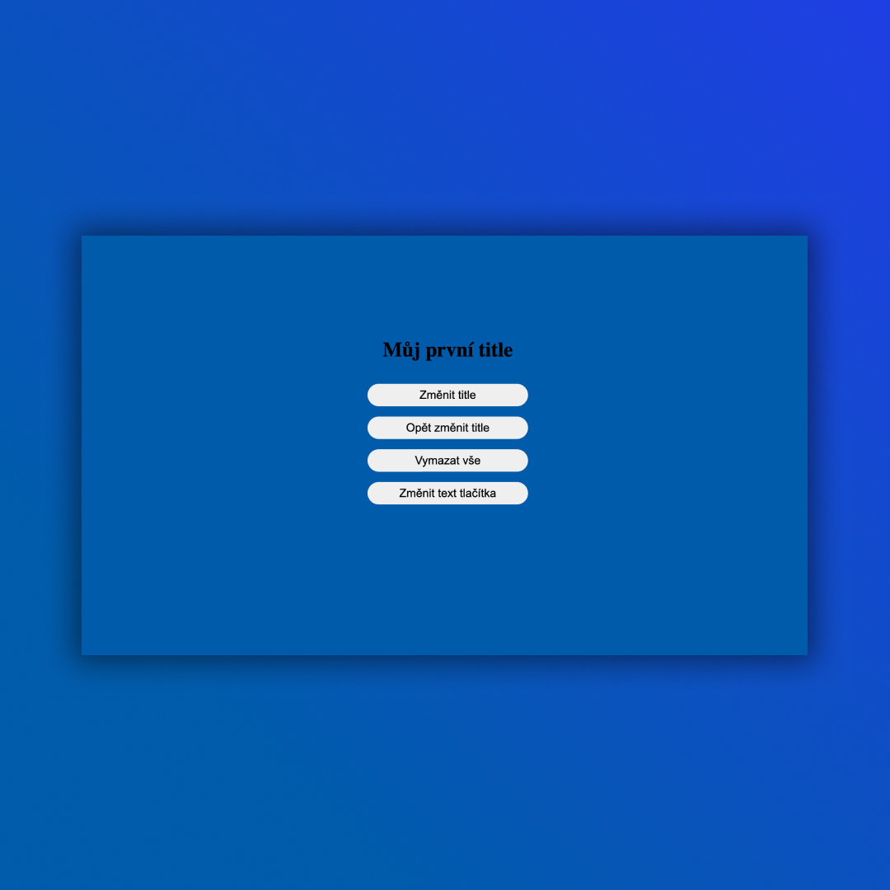

## Project in React with useState
•  useState is a hook in React ✅

## Screenshots 📱

## 💻 Tech Stack

## 🌐 Link
<a href="https://react-hooks-dejvcodes.netlify.app/">React-Hooks</a>

## License🔐
[MIT License](LICENSE)